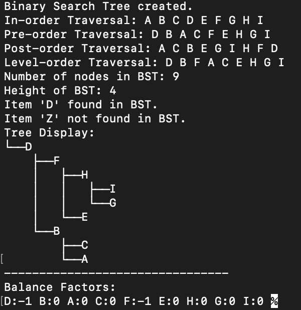

_________________
# COMP 318 - Project 2

 **by Paedar Rader**
###### Due April 12, 2024
---

\
__Description:__ This project includes the implementation of a binary tree, binary search tree, and AVL tree classes. All of these classes have their own indepedent methods, but both the BST and balancedBST classes inherit from the binaryTree base class, which contains the TreeNode struct declaration, which is the primary data structure utilized by the binary trees. *This program also prints out a binary tree, in horizontal format. This format allows for better readability, easier alignment, and still offers all the visual benefits of a binary tree. This was chosen vs the vertical tree, as I had issues with the clang versions of C++ outputting correctly.*
 

**For a more detailed description of each method, view the *AVLTrees.h* file.**

__Github Page: `https://github.com/paedarr/comp318Project2`__

---

### __Sample Output__ 

###### Using the current *main.cpp* file:

 

**Please note that this output may be different based on what your *main.cpp* file looks like.**

---

### File List: 
- AVLTrees.cpp
- AVLTrees.h
- main.cpp
- Makefile
- README.md
- output_sample.png

 

---

### Dependencies:

- File List (required)
    - AVLTrees.cpp
    - AVLTrees.h
    - main.cpp
    - Makefile
    - output_sample.png <- (needed for README.md)
- C++ Version 11+
- (optional __Apple GPP Compiler__) -> *Apple Clang Version 14.0.0* 

 

---

## How to Compile & Run:

1. Once in the project folder, run the following command:\
`make EXEC=<executable_name>`
2. Your executable will be compiled, and created with the name you have chosen. To execute, run the following command:\
`./<executable_name>`
3. The program should output, and complete successfully.

 

---

### Current Test File:
The *main.cpp* file contains a test for all the main functionality of the program. It includes searching for a given node, insertion, traversals, and displaying all said information, including the Binary Tree itself. Utilizing the current *main.cpp* file will output with some formatting which is specifically included in the *main.cpp* file.

---

\
__Honor Pledge:__ I have abided by the Wheaton College Honor Code in this work: *Paedar Rader*